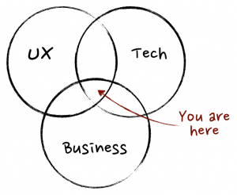

## There is no such thing as a “Non-Technical Product Manager”

Doctors cannot treat their patients without understanding organic chemistry. A builder cannot construct a building without understanding architectural drawings. Similarly, product managers cannot “make product decisions” without understanding the underlying technology upon which their products are based. So why are there so many people who call themselves “Product Managers” but have no technical abilities?

You wouldn’t trust a doctor to perform surgery on you if you knew that this _“doctor”_ had no knowledge about organic chemistry. Nor would you walk into a building that you knew was constructed by some bloak who couldn’t read the building’s plans. So, why should we trust “product managers” who nothing about how their products are built?

We shouldn’t. Having worked at several tech start-ups in product manager roles, I am convinced that there is no such thing as a “non-technical product manager”. By definition, product managers must be technical. They must be able to discuss, beyond a superficial level, the underlying technology that defines the product they are managing. Otherwise, their product ideas are nothing more than echo chambers, reflecting the latest observed behavior — high value-added stuff!

However, this does not mean that all PMs must be engineers. Nor am I suggesting that product managers must have degrees in technical fields. Knowing about the underlying technology is important for diagnosing bugs, discovering opportunities, conceiving of valuable product enhancements, and understanding the complexity of delivering requested features. For software, being able to code is important, though a detailed understanding of concurrency, algorithms, and performance optimization is probably overkill. However, it is simply not enough to say that an app must be fast and responsive. Obvious statements like this only reduce the credibility of the person speaking it. Instead, try taking free courses on Coursera or Udacity to get up to speed. Pick a language — any language — and **learn your craft**. Being conversant, not necessarily an expert, is the goal. Once you know enough to be dangerous on the command line, try marrying this technical knowledge with honed business and analytics fundamentals over at General Assembly.

Most importantly, try building something! Try building a product from scratch on your own. The challenge will force you to practice each of the functions necessary to launch and manage a product in a market. Build it. Ship it. Market it. Maintain it. Gather user feedback. Iterate.

Check out these books. They are quick reads, well-written, and have helped me do product management right!

- The Product Manager’s Survival Guide: Everything You Need to Know to Succeed as a Product Manager
- Take Charge Product Management
- Confessions of a Product Manager

If you can’t do any of these (or don’t love doing any of these), I am sorry to inform you that you are **not** a product manager. I don’t care what your LinkedIn profile says or what title you gave yourself on your resume. If all you can do is discuss margins, market size, growth, and go-to-market strategy, you’re a business person, not a product manager. On the other hand, if you can also design experiences that drive user behavior, use data to make decisions, lead teams (technical and non-technical), communicate effectively, listen to others, understand products at a technical level, and survive over-bearing CEOs, then you are probably an awesome product manager!
